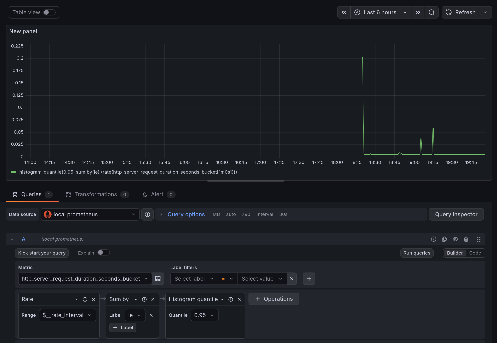

# Observability

## Start monitoring

Create a folder `o11y` and and place these two files inside it:

- [docker-compose.yml](./docker-compose.yml)
- [prometheus.yml](./prometheus.yml)

Start the observability containers using:

```bash
docker compose up
```

Prometheus should run on http://localhost:9090/ and Grafana on http://localhost:3000.


## Understanding Prometheus

1. Open Prometheus on http://localhost:9090/
2. Go to Status -> Target Health
3. You should see 2 connections. "client" is not set up, so it will show an error. "edu.jakobmeier.ch" should work but you may have to wait up to 30 seconds after starting prometheus for the first data scrapping to occur.
4. Go to query and check out these two metrics:
    - player_lookup_total
        - This is a simple counter, labelled by team.
        - Look at the table view as well as the graph view.
    - http_server_request_duration_seconds_bucket
        - This is a histogram, tracking the time to respond to HTTP requests.
        - There are many labels here. You can filter the displayed data, for example to only show successful requests to the main page at "/", use this query:
        `http_server_request_duration_seconds_bucket{http_route="",http_response_status_code="200"}`
        - Try out changing these filters and look at the results in the table view.


## Set up Grafana

### Data connection

1. Access Grafana on http://localhost:3000 with username = `admin` and password also `admin`.
2. Go to "Connections" -> "Add new connection".
3. Add a Prometheus source and set the URL to http://prometheus:9090. (This is the URL in the isolated docker network.)

### Dashboard

1. Go To "Dashboard" -> "Create Dashboard"
2. "Add Visualization" -> Select the data source configured in the last step
3. At the bottom, you should see query A. Select the metric `http_server_request_duration_seconds_bucket`. This contains the timings of the server when it answered HTTP requests.


4. This metric contains histogram data, storing a count for each predefined bucket. We want to display the 95th percentile and show it as a line graph. To do that, simply click on "hint: add histogram quantile", which will add the necessary functions to the query. The query should now be `histogram_quantile(0.95, sum by(le) (rate(http_server_request_duration_seconds_bucket[$__rate_interval])))`
5. Click on "Refresh" at the top right.
6. You should now see data.



7. Go back to the dashboard, then save the dashboard.
8. Next: Add another visualization for the counter metric `player_lookup_total`. This is not a histogram, you can directly display it as a line graph. Since the counter is labelled by team, you can set it up such that is shows one line for each team.


## Connect your client

1. Find a prometheus library that works with your tech stack.
2. Add a Prometheus exporter to your own project and expose the metrics at `/metrics`.
3. Open `http://localhost:1234/metrics` (adjust the port accordingly). You should see all available metrics listed. This might be empty if you haven't added any metrics, yet.
4. Add a metric. For example a timing histogram for how long it takes your server to responds to a request.
5. Confirm you see your metric in `http://localhost:1234/metrics`.
6. Edit `prometheus.yml`. Update the port in `- targets: ["host.docker.internal:1234"]` to match your client address. (Note: Do not use `localhost` here. Inside the docker container, `localhost` connects to services in the same container. Your host's `localhost` can be accessed as `host.docker.internal:1234`.)
7. Restart the prometheus container.
8. Check on [http://localhost:9090/targets](http://localhost:9090/targets) if Prometheus has now connected to the client
9. Add a new data source in Grafana for your client
10. Create a new dashboard and visualize the metric you have added.